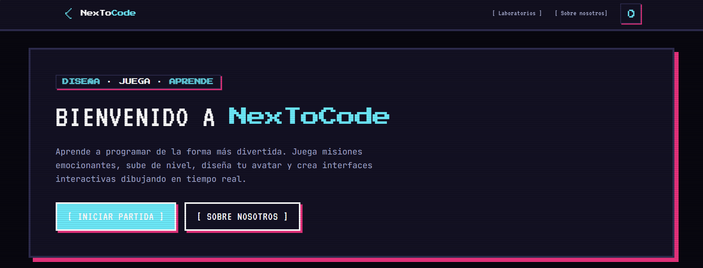
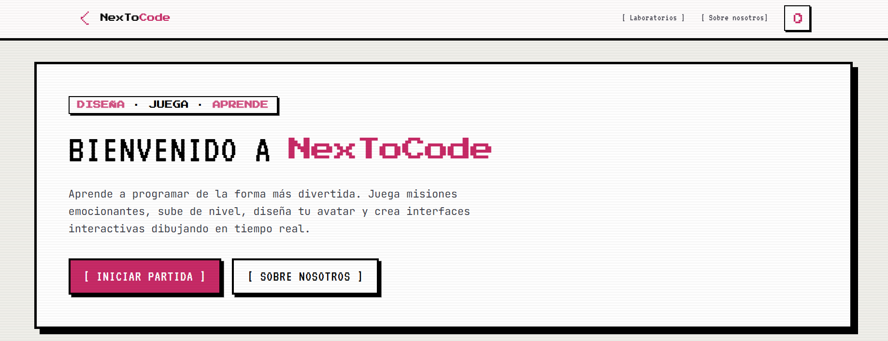
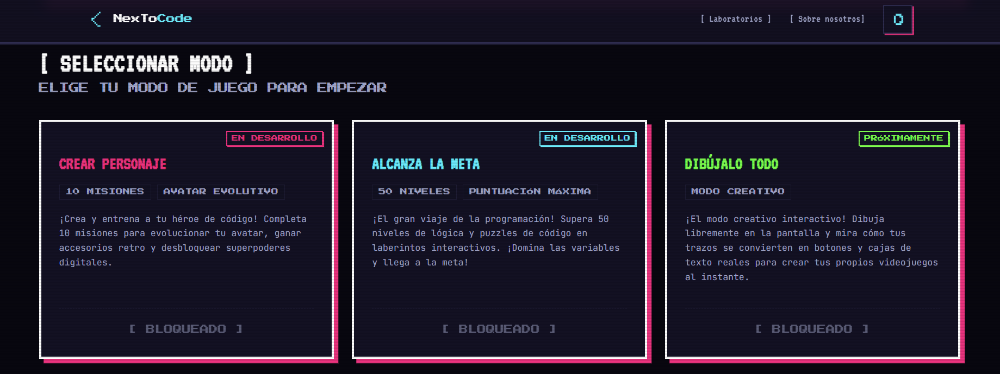
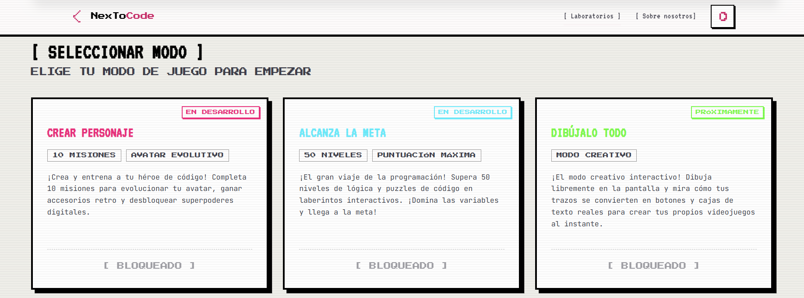

# NexToCode — Plataforma de Programación Gamificada (8-Bit Neon)

[](https://astro.build)
[](https://tailwindcss.com)
[](https://www.typescriptlang.org)

##  Enfoque del Proyecto

**NexToCode** es una plataforma interactiva de aprendizaje de programación diseñada especialmente para niños de escuela. Su enfoque principal es la gamificación, convirtiendo conceptos abstractos de código en mecánicas de juego comprensibles y motivadoras.

Toda la interfaz del usuario está inspirada en un gabinete arcade retro de 8 bits con colores neón (cían, rosa caliente y verde lima). Esto crea un ambiente de juego inmersivo directamente en el navegador, motivando a los estudiantes a explorar y aprender sin temor a equivocarse.

---

## Capturas de Pantalla

*(Toma capturas de pantalla de tu navegador y guárdalas con estos nombres en la carpeta `/public` para que se visualicen aquí)*

### Panel Principal (Arcade Console - Dark Mode)


### Panel Principal (Arcade Console - Light Mode)


### Selección de Modos de Juego (Dark Mode)


### Selección de Modos de Juego (Light Mode)


---

##  Características del Sistema

### 1. Modos de Juego Disponibles

- **Crear Personaje (Evolución por IA)**: Un modo enfocado en diseñar un héroe o avatar virtual. Dividido en 10 misiones asistidas por Inteligencia Artificial, donde cada problema de código resuelto otorga habilidades y accesorios retro al personaje.
- **Alcanza la Meta (Puzzles de Lógica)**: Una campaña lineal de 50 niveles con dificultad progresiva. Los niños guían a su aventurero resolviendo desafíos lógicos básicos (variables, condicionales y bucles simples) para encontrar la salida de cada laberinto.
- **Dibújalo Todo (Compilador Creativo)**: Un lienzo libre tipo "pinturillo" interactivo. Al dibujar formas básicas (cajas, líneas, botones), la plataforma las transforma al instante en elementos de interfaz de usuario reales e interactivos mediante código.

### 2. Clase de Héroe Activa: Python
Actualmente la plataforma está optimizada para **Python**, el lenguaje de programación más amigable del mundo para principiantes y niños. Los laboratorios permiten escribir y ejecutar scripts directamente en un compilador web integrado.

### 3. Sistema Visual 8-Bit Cyber-Retro
- **Filtro Monitor CRT**: Simulación estática de barrido de líneas de monitor analógico de videojuegos clásicos.
- **Paleta de Colores Neón**: Contraste alto con fondo espacial en modo oscuro (sombras rosa neón, bordes cian) y modo de consola clásico en modo claro.
- **Feedback Físico**: Los botones y menús utilizan una animación de desplazamiento plano en tres dimensiones al hacer clic (simulando pulsar un botón arcade real).

---

## 🛠️ Stack Tecnológico

| Capa | Tecnología |
|------|-----------|
| **Core Framework** | [Astro v6](https://astro.build) |
| **Estilos** | [Tailwind CSS v4](https://tailwindcss.com) (Vite integration) |
| **Fuentes de Texto** | Google Fonts: `Press Start 2P`, `VT323` |
| **Motor de Código** | [Compiler Explorer](https://godbolt.org) en iframe modular |

---

## 🚀 Inicio Rápido

Para iniciar el servidor del juego de forma local:

```bash
# 1. Clonar el repositorio
git clone https://github.com/TuUsuario/NexToCode.git
cd NexToCode

# 2. Instalar dependencias
npm install

# 3. Iniciar en modo de desarrollo
npm run dev
```

El servidor local se abrirá en `http://localhost:4321`.

---

## 📁 Estructura General

```text
NexToCode/
├── src/
│   ├── components/
│   │   ├── LabCard.astro           # Tarjetas del juego (cartuchos)
│   │   └── labs/
│   │       └── LabRunner.astro     # Consola y simulador interactivo
│   ├── layouts/
│   │   ├── BaseLayout.astro        # Consola principal (Header/Footer/CRT)
│   │   └── LabLayout.astro         # Plantilla del visor de misiones
│   ├── pages/
│   │   ├── index.astro             # Pantalla de Inicio (Arcade Dashboard)
│   │   ├── about.astro             # Especificaciones técnicas y Créditos
│   │   └── labs/
│   │       ├── index.astro         # Explorador de laboratorios
│   │       └── [lenguaje]/
│   │           ├── index.astro     # Filtro por lenguaje de programación
│   │           └── [slug].astro    # Misión individual activa
│   └── styles/
│       └── global.css              # Estilos del sistema de 8 bits y variables neón
└── README.md
```
